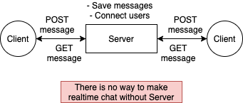

# Realtime Chat App for practice

## With websocket (Dev)

Enter to [repo](./with_websocket/README.md)

 
 

## With socket io (Dev, Deploy)

- Try to use deployed chat web from [here](https://laughing-payne-8cc557.netlify.app)

- You can check server state from [here](https://rchat-pratice.herokuapp.com)

- Enter to [repo](./with_socket.io/README.md)

 
 

## Structure

